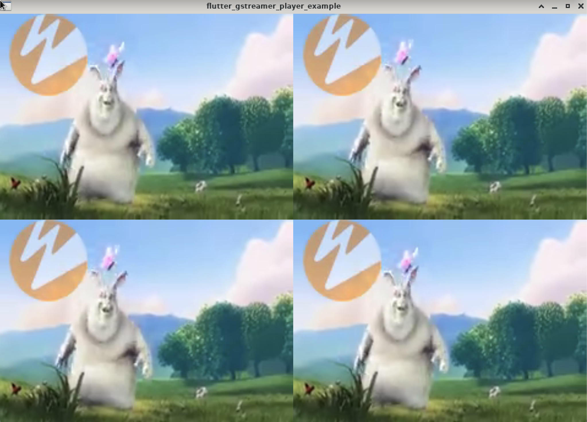

# GStreamer Player Plugin

A GStreamer-powered alternative to Flutter's video_player that support Linux, iOS and Android.



<a href="https://www.buymeacoffee.com/phongnh36a" target="_blank"></a>

## Installation

### Linux

Follow GStreamer's [Install on Linux](https://gstreamer.freedesktop.org/documentation/installing/on-linux.html?gi-language=c) instuction.

### iOS

Follow GStreamer's [Install on iOS](https://gstreamer.freedesktop.org/documentation/installing/for-ios-development.html?gi-language=c) instuction, step `Prerequisites` and `Download and install GStreamer binaries`.

Link GStreamer framework to `ios` directory for flutter's ios build system.

```
ln -s /Users/<Your_User_Name>/Library/Developer/GStreamer/iPhone.sdk/GStreamer.framework ios/GStreamer.framework
```

### Android

Follow GStreamer's [Install on Android](https://gstreamer.freedesktop.org/documentation/installing/for-android-development.html?gi-language=c) instuction, step `Prerequisites` and `Download and install GStreamer binaries`.

In Android, you need to init GStreamer in main activity of your flutter application.
In your flutter application, edit `MainActivity.kt` or `MainActivity.java` file, depends on your flutter config
(This file is usually located at `android/app/src/main/<PATH_DEPPEND_ON_YOUR_FLUTTER_APPLICATION>/MainActivity.kt`).
Import GStreamer module and override `onCreate` of `MainActivity` class to init GStreamer, the end result should looks like bellow.

```
import org.freedesktop.gstreamer.GStreamer

class MainActivity: FlutterActivity() {
  override fun onCreate(savedInstanceState: Bundle?) {
    super.onCreate(savedInstanceState)

    GStreamer.init(this);
  }
}
```

This source code has been tested with GStreamer 1.20.1 [prebuild binary](https://gstreamer.freedesktop.org/data/pkg/android/)

## Getting Started

To start using the plugin, copy this code or follow the example project in `example`

```
import 'package:flutter/material.dart';

import 'package:flutter/services.dart';
import 'package:flutter_gstreamer_player/flutter_gstreamer_player.dart';

void main() {
  runApp(const MyApp());
}

class MyApp extends StatelessWidget {
  const MyApp({Key? key}) : super(key: key);

  @override
  Widget build(BuildContext context) {
    return MaterialApp(
      home: Scaffold(
        body: GstPlayer(
            pipeline:
              '''rtspsrc location=
                  rtsp://wowzaec2demo.streamlock.net/vod/mp4:BigBuckBunny_115k.mp4 !
                rtph264depay !
                h264parse !
                decodebin !
                videoconvert !
                video/x-raw,format=RGBA !
                appsink name=sink''',
          ),
        ),
      ),
    );
  }
}
```

## License

Copyright (c) 2022, Nguyen Hoai Phong <phongnh.36@gmail.com>.

This library & work under this repository is licensed under MIT License.
